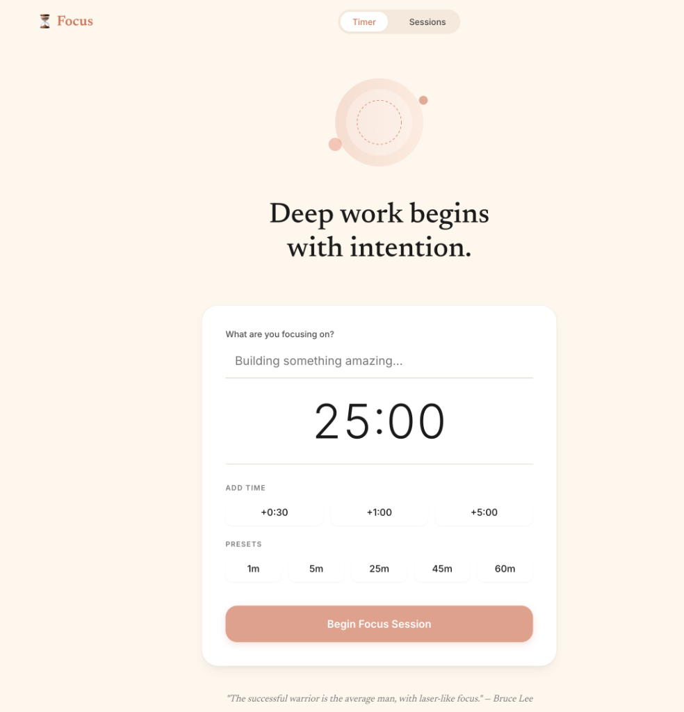

# Focus Timer

A beautiful, minimal focus timer application built with **Flask** and **React**, featuring an Anthropic-inspired aesthetic.


*Note: Add a screenshot of your app here if you like!*

## ✨ Features

- **Deep Work Timer**: Set custom durations or use quick presets (5m, 25m, 45m, 60m).
- **Minimalist Design**: A clean, distraction-free interface with pulsing animations and terracotta accents.
- **Session Tracking**: Rate your focus quality, add notes, and record key learnings after each session.
- **History & Analytics**: View your "Focus Journey" with detailed stats and session history grouped by date.
- **Dynamic Inspirations**: Intelligent placeholders that spark creativity (e.g., "Debugging the universe...").
- **Local Persistence**: All data is securely stored locally in a SQLite database.

## 🛠️ Tech Stack

- **Backend**: Python, Flask, SQLAlchemy
- **Frontend**: React (served via CDN with Babel), standard CSS
- **Database**: SQLite

## 🚀 Getting Started

### Prerequisites

- Python 3.8+
- `pip` (Python package installer)

### Installation

1.  **Clone the repository**
    ```bash
    git clone https://github.com/sanjuprk/focus-timer.git
    cd focus-timer
    ```

2.  **Create a virtual environment (Optional but recommended)**
    ```bash
    # macOS/Linux
    python3 -m venv .venv
    source .venv/bin/activate

    # Windows
    python -m venv .venv
    .venv\Scripts\activate
    ```

3.  **Install dependencies**
    ```bash
    pip install -r requirements.txt
    ```

### Running the App

1.  **Start the server**
    ```bash
    python app.py
    ```

2.  **Open in Browser**
    Visit [http://127.0.0.1:5001](http://127.0.0.1:5001) in your favorite browser.

## 📝 Usage

1.  **Set an Intention**: Type what you are focusing on (e.g., "Reading System Design").
2.  **Choose Duration**: Select a preset or add time in increments.
3.  **Focus**: The timer will count down. If you finish early, click "Done Early".
4.  **Reflect**: When the timer ends, rate your session and jot down any insights.
5.  **Review**: Check the "Sessions" tab to see your progress over time.

## 📄 License

This project is open source and available under the [MIT License](LICENSE).
